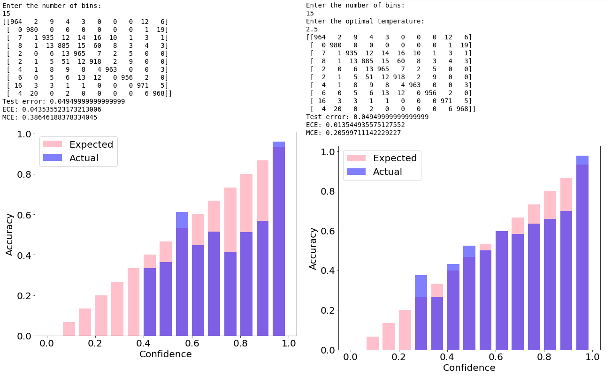

# Focal Calibration

[](https://arxiv.org/abs/2002.09437)
[](https://pytorch.org/)
[](https://github.com/torrvision/focal_calibration/blob/main/LICENSE)

This repository contains the code for [*Calibrating Deep Neural Networks using Focal Loss*](https://arxiv.org/abs/2002.09437) ([blog](https://torrvision.github.io/focal_calibration/)), which has been accepted in NeurIPS 2020.

If the code or the paper has been useful in your research, please add a citation to our work:

```
@article{mukhoti2020calibrating,
  title={Calibrating Deep Neural Networks using Focal Loss},
  author={Mukhoti, Jishnu and Kulharia, Viveka and Sanyal, Amartya and Golodetz, Stuart and Torr, Philip HS and Dokania, Puneet K},
  booktitle={Advances in Neural Information Processing Systems},
  year={2020}
}
```

## Dependencies

The code is based on PyTorch and requires a few further dependencies, listed in [environment.yml](environment.yml). It should work with newer versions as well.

### Datasets

Most datasets will be downloaded directly on running the code. However, [Tiny ImageNet](https://tiny-imagenet.herokuapp.com/) needs to be downloaded separately for the data loader to work.

### Pretrained models

All the pretrained models for all the datasets can be [downloaded from here](http://www.robots.ox.ac.uk/~viveka/focal_calibration/).

## Training a model

In order to train a model, please use the [train.py](train.py) code. The default configuration (i.e., just running ```python train.py```) will train a ResNet50 model on the cross-entropy loss function. The following are the important parameters of the training:
```
--dataset: dataset to train on [cifar10/cifar100/tiny_imagenet]
--dataset-root: path of the Tiny ImageNet dataset (not necessary for CIFAR-10/100)
--loss: loss function of choice (cross_entropy/focal_loss/focal_loss_adaptive/mmce/mmce_weighted/brier_score)
--gamma: gamma for focal loss
--lamda: lambda value for MMCE
--gamma-schedule: whether to use a scheduled gamma during training
--save-path: path for saving models
--model: model to train (resnet50/resnet110/wide_resnet/densenet121)
```

The shell scripts to train different models on different datasets are available in [train_scripts](train_scripts) folder.
As an example, in order to train a ResNet-50 model on CIFAR-10 using focal loss with ```gamma = 3```, we can write the following script:
```
python train.py --dataset cifar10 --model resnet50 --loss focal_loss --gamma 3.0
``` 

## Evaluating a model

In order to evaluate a trained model, either use the [evaluate_single_model.ipynb](Experiments/evaluate_single_model.ipynb) notebook or you can also use the [evaluate.py](evaluate.py) code. The shell scripts for using it are present in [evaluate_scripts](evaluate_scripts) folder. The evaluation code provides values of calibration error scores ECE, AdaECE and Classwise-ECE along with model accuracy. In order to use the code the following parameters need to be provided:
```
--dataset: dataset to evaluate on [cifar10/cifar100/tiny_imagenet]
--dataset-root: path of the Tiny ImageNet dataset (not necessary for CIFAR-10/100)
--model: model to train (resnet50/resnet110/wide_resnet/densenet121)
--save-path: path showing the trained model's location
--saved_model_name: name of the saved model file
--cverror: error to cross-validate on for temperature scaling (ece/nll)
```

As an example, to evaluate a ResNet-50 model trained on CIFAR-10, run the code as:
```
python evaluate.py --dataset cifar10 --model resnet50 --save-path /path/to/saved/model/ --saved_model_name resnet50_cross_entropy_350.model --cverror ece
```

The jupyter notebook is simpler to use and quite self explanatory. The following is the result of evaluating the ResNet-50 we trained using the cross-entropy objective.



The test-set classification errors and ECE values obtained from ResNet-50, ResNet-110, Wide-ResNet-26-10 and DenseNet-121 trained on CIFAR-10 are provided in the tables below. For more results, please refer to the paper. The following table shows the CIFAR-10 test set classification error %.

| Model Architecture  | Cross-Entropy | Brier Loss | MMCE | LS-0.05 | FL-3 (Ours) | FLSD-53 (Ours) |
| ---  | --- | --- | --- | --- | --- | --- |
| ResNet-50  | 4.95 | 5.0 | 4.99 | 5.29 | 5.25 | 4.98 |
| ResNet-110  | 4.89 | 5.48 | 5.4 | 5.52 | 5.08 | 5.42 |
| Wide-ResNet-26-10  | 3.86 | 4.08 | 3.91 | 4.2 | 4.13 | 4.01 |
| DenseNet-121  | 5.0 | 5.11 | 5.41 | 5.09 | 5.33 | 5.46 |

The following table shows the CIFAR-10 test set ECE % for the same models.

| Model Architecture  | Cross-Entropy | Cross-Entropy (T) | Brier Loss | Brier Loss (T) | MMCE | MMCE (T) | LS-0.05 | LS-0.05 (T) | FL-3 (Ours) | FL-3 (T) (Ours) | FLSD-53 (Ours) | FLSD-53 (T) (Ours) |
| ---  | --- | --- | --- | --- | --- | --- | --- | --- | --- | --- | --- | --- |
| ResNet-50  | 4.35 | 1.35 (2.5) | 1.82 | 1.08 (1.1) | 4.56 | 1.19 (2.6) | 2.96 | 1.67 (0.9) | **1.48** | 1.42 (1.1) | 1.55 | **0.95 (1.1)** |
| ResNet-110  | 4.41 | 1.09 (2.8) | 2.56 | 1.25 (1.2) | 5.08 | 1.42 (2.8) | 2.09 | 2.09 (1) | **1.55** | **1.02 (1.1)** | 1.87 | 1.07 (1.1) |
| Wide-ResNet-26-10  | 3.23 | 0.92 (2.2) | **1.25** | 1.25 (1) | 3.29 | 0.86 (2.2) | 4.26 | 1.84 (0.8) | 1.69 | 0.97 (0.9) | 1.56 | **0.84 (0.9)** |
| DenseNet-121  | 4.52 | 1.31 (2.4) | 1.53 | 1.53 (1) | 5.1 | 1.61 (2.5) | 1.88 | 1.82 (0.9) | 1.32 | 1.26 (0.9) | **1.22** | **1.22 (1)** |

In the above tables, LS-0.05 denotes cross-entropy loss with label smoothing with a smoothing factor of 0.05, FL-3 denotes focal loss with ```gamma = 3``` and FLSD-53 denotes adaptive focal loss.


## OOD Notebook

To plot the ROC curve and compute the AUROC for a model trained on CIFAR-10 (in-distribution dataset) and tested on SVHN (out-of-distribution dataset), please use the [evaluate_single_model_ood.ipynb](Experiments/evaluate_single_model_ood.ipynb) notebook. The following is the ROC plot obtained from the ResNet-50 model which we trained on CIFAR-10 using the cross-entropy objective function.

<p align="center">
	
</p>

## Questions

If you have any questions or doubts, please feel free to open an issue in this repository or reach out to us at the email addresses provided in the paper.
