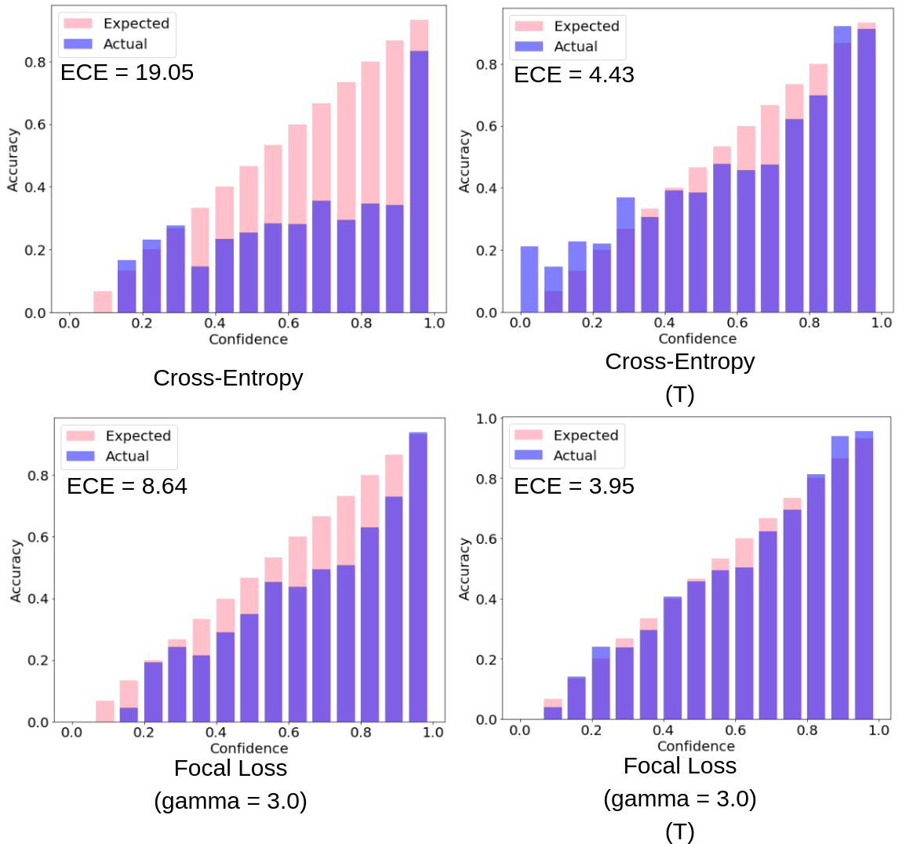
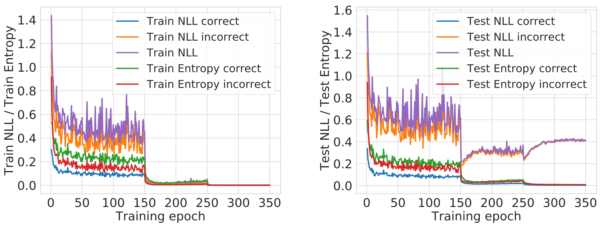
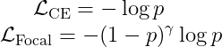
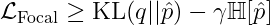
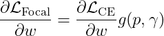
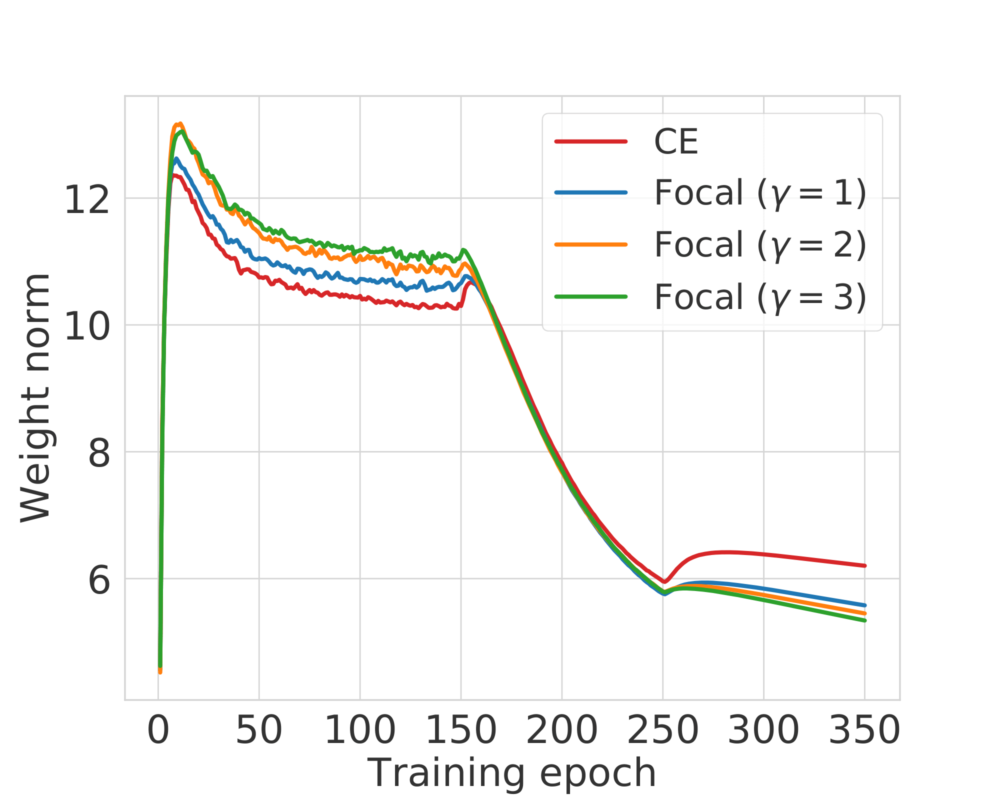
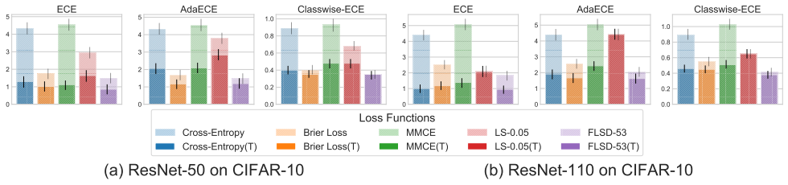
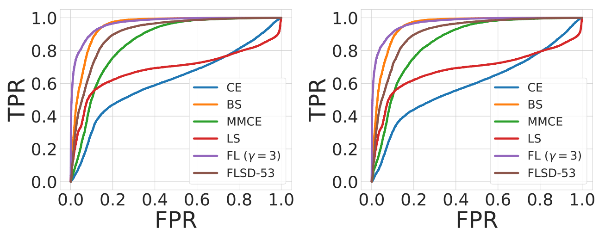

## [Calibrating Deep Neural Networks using Focal Loss](https://arxiv.org/abs/2002.09437)

### What we want
* Overparameterised classifier deep neural networks trained on the conventional cross-entropy objective are known to be [overconfident and thus miscalibrated](https://arxiv.org/abs/1706.04599).
* With these networks being deployed in real-life applications like autonomous driving and medical diagnosis, it is imperative for them to predict with calibrated confidence estimates.
* Ideally, we want a model which is *confident on its correct predictions*, produces *calibrated probability estimates* and also achieves *state-of-the-art test set accuracy*.

### What we do
* We explore an alternative loss function, [**focal loss**](https://arxiv.org/abs/1708.02002) for training models.
* Focal loss significantly **outperforms cross-entropy** and other baselines on calibration error scores (e.g. ECE) **without compromising on test set accuracy**.
* This improvement in focal loss is present both **pre and post temperature scaling**.
* We propose a sample-dependent adaptive way of deciding , the focal loss hyperparameter.
* Finally, we show that training on focal loss can be better than post-hoc calibration using temperature scaling, especially on **out-of-distribution samples**.

<p align="center">
	
	<br>
	<em>Fig. 1: Reliability diagrams for a ResNet110 trained on CIFAR-100</em>
</p>

## What Causes Miscalibration?

* We train a ResNet-50 on CIFAR-10 using cross-entropy loss for 350 epochs.
* The initial learning rate is 0.1 and it drops by a factor of 10 at epochs 150 and 250.
* We plot the NLL and entropy of the softmax distribution over the course of training for both correctly and incorrectly classified train and test samples.

<p align="center">
	
	<br>
	<em>Fig. 2: NLL and softmax entropy computed over CIFAR-10 train and test sets (for correctly and incorrectly classified samples) over the course of training a ResNet-50 usign cross-entropy loss.</em>
</p>

Two observations are worth noting from the above plots:
1. **Curse of misclassified samples:** The NLL overfitting is quite apparent after training epoch 150. Also, *the rise in test set NLL is only because of misclassified test samples*.
2. **Peak at the wrong place:** While the test set NLL rises, the test set entropy decreases throughout training even for misclassified samples. Hence, *the model gets more and more confident on its predictions irrespective of their correctness*.

We posit the reason behind the above observations as follows:
* Even after obtaining a 100% training accuracy, the optimiser can still reduce the loss further by increasing the model's confidences on its predictions.
* In order to increase its confidence, the model *increases the magnitudes of the logits which in turn is achieved by increasing the magnitudes of its weights*.

## Improving Calibration using Focal Loss

We explore an alternative loss function, [focal loss](https://arxiv.org/abs/1708.02002). Below are the forms of the two loss functions, cross-entropy (CE) and focal loss (Focal) (assuming one-hot ground truth encodings):

<p align="center">
	
</p>

In the above equations  is the probability assigned by the model to the ground-truth correct class. When compared with cross-entropy, focal loss has an added  factor. The idea behind this is to give more preference to samples for which the model is placing less probability mass on the correct class.  is a hyperparameter.

### Why might focal loss improve calibration?

**Focal Loss minimises a regularised KL divergence.**
We know that cross-entropy loss minimises the [Kullback-Leibler (KL)](https://en.wikipedia.org/wiki/Kullback%E2%80%93Leibler_divergence) divergence between the target distribution  over classes and the predicted softmax distribution . As it turns out, focal loss minimises a *regularised KL divergence* between the target and predicted distributions as shown below.

<p align="center">
	
</p>

* The regulariser is the entropy of the predicted distribution and the regularisation coefficient is .
* Hence, focal loss tries to minimise the KL divergence between the predicted and target distributions while at the same time increasing the entropy of the predicted distribution.
* Note that in the case of one-hot target distributions, only the component of entropy corresponding to the ground-truth correct class (i.e., ) is maximised.
* This *prevents the predicted softmax distributions from becoming too peaky (low entropy)* and the model from becoming overconfident.

### How does focal loss fare on NLL overfitting?

On the same training setup as above (i.e., ResNet-50 on CIFAR-10), if we use focal loss with  values set to 1, 2 and 3, the test set NLL vs training epochs plot is as follows.

<p align="center">
	
    <br>
	<em>Fig. 3: Test set NLL computed over different training epochs for ResNet-50 models trained using cross-entropy and focal loss with  values 1,2 and 3.</em>
</p>

* **NLL overfitting is significantly reduced for models trained using focal loss!** 
* There also seems to be an ordering to this betterment where focal loss with  outperforms focal loss with , which outperforms the one with .

### Does focal loss regularise model weights?

If we consider the gradient of focal loss with respect to the last layer model weights  and the same for cross-entropy, we find that for a single sample, the following relation exists.

<p align="center">
	
</p>

The factor  is a function of both the predicted correct class probability  and . On plotting  against  for different values of , we get the following plot.

<p align="center">
	
    <br>
	<em>Fig. 4:  vs  plot.</em>
</p>

* We see a pattern here, that higher  leads to higher gradient in focal loss for low values of  and dying gradients for higher . 
* We use this observation to *adaptively select*  *sample wise* such that the network can give more weight to samples with lower correct class probability. We call this training method as FLSD.
* For each value of ,  when  is above a certain threshold probability.
* This means that during training, *once the network starts getting more confident on its predictions, the gradients for focal loss start having lower and lower norm* as compared to the gradients for cross-entropy.
* Accordingly, the *weight norms for focal loss should also reduce as compared to that of cross-entropy*. To see this empirically, we plot the weight norms of the last linear layer for our training setup.

<p align="center">
	
    <br>
	<em>Fig. 5: Weight norm of the last linear layer over the course of training.</em>
</p>

* For the first few training epochs, the focal loss weight norms are larger than cross-entropy.
* However, after epoch 150, the point from where the network starts getting miscalibrated, *the ordering of weight norms completely reverses and focal loss has lower weight norms than cross-entropy*.

This provides strong evidence in favour of our hypothesis that **focal loss regularises weight norms in the network once the network achieves a certain level of confidence on its predictions**.


## Empirical Results

### Classification Results (Calibration and Accuracy)

* We test the performance of focal loss on several datasets, architectures and using multiple different calibration error scores which include the [Expected Calibration Error](https://people.cs.pitt.edu/~milos/research/AAAI_Calibration.pdf) (ECE), Adaptive ECE (AdaECE), Classwise-ECE and others.
* We also compare with loss baselines other than cross-entropy, like [Brier Score](https://journals.ametsoc.org/mwr/article/78/1/1/96424/VERIFICATION-OF-FORECASTS-EXPRESSED-IN-TERMS-OF), [MMCE](http://proceedings.mlr.press/v80/kumar18a/kumar18a.pdf) and cross-entropy with [label smoothing](https://arxiv.org/pdf/1906.02629.pdf).
* We present error bars with confidence intervals for ECE, AdaECE and Classwise-ECE for ResNet-50 and ResNet-110 trained on [CIFAR-10](https://www.cs.toronto.edu/~kriz/cifar.html) as well as the test set classification error for the same models below.

<p align="center">
	
    <br>
	<em>Fig. 6: Error bar plots with confidence intervals for ECE, AdaECE and Classwise-ECE computed for ResNet-50 (first 3 from the left) and ResNet-110 (first 3 from the right) on CIFAR-10. T: post-temperature scaling</em>
</p>

| Model Architecture  | Cross-Entropy | Brier Loss | MMCE | LS-0.05 | FL-3 (Ours) | FLSD-53 (Ours) |
| ---  | --- | --- | --- | --- | --- | --- |
| ResNet-50  | 4.95 | 5.0 | 4.99 | 5.29 | 5.25 | 4.98 |
| ResNet-110  | 4.89 | 5.48 | 5.4 | 5.52 | 5.08 | 5.42 |


* Models trained using **focal loss broadly outperform all other baselines on all the metrics both before and after temperature scaling**!
* In quite a few cases, the difference in performance is statistically significant.
* Moreover, models trained on focal loss do not compromise on test set error or accuracy. All the models we train obtain test set classification errors in the same ballpark.


### Detection of OOD Samples

We run the models trained using CIFAR-10 on test data drawn from the [SVHN](http://ufldl.stanford.edu/housenumbers) dataset which is out-of-distribution and consider the softmax entropy of these networks as a measure of uncertainty. For ResNet-110, the ROC plots obtained from this experiment are provided below.

<p align="center">
	
    <br>
	<em>Fig. 7: ROC plots obtained from ResNet-110 trained on CIFAR-10 and tested on SVHN. Left: pre-temperature scaling, right: post-temperature scaling.</em>
</p>

* The results indicate that models trained on focal loss, with *higher AUROC*, are able to detect out-of-distribution samples from SVHN much better than models trained on cross-entropy loss.
* What is particularly important to see here is that this improved performance is shown both pre and post temperature scaling!

Thus, focal loss seems to be a good alternative to the conventionally used cross-entropy loss for producing confident and calibrated models without compromising on classification accuracy. [Our paper](https://arxiv.org/abs/2002.09437) provides with a lot more experiments and analysis, please have a look. [The code with all the pretrained models](https://github.com/torrvision/focal_calibration) is also available.

## Citation and Contact

If the code or the paper has been useful in your research, please add a citation to our work:
```
@article{mukhoti2020calibrating,
  title={Calibrating Deep Neural Networks using Focal Loss},
  author={Mukhoti, Jishnu and Kulharia, Viveka and Sanyal, Amartya and Golodetz, Stuart and Torr, Philip HS and Dokania, Puneet K},
  booktitle={Advances in Neural Information Processing Systems},
  year={2020}
}
```
For any questions related to this work, please feel free to reach out to us at <jishnu.mukhoti@eng.ox.ac.uk> or <viveka@robots.ox.ac.uk>.
